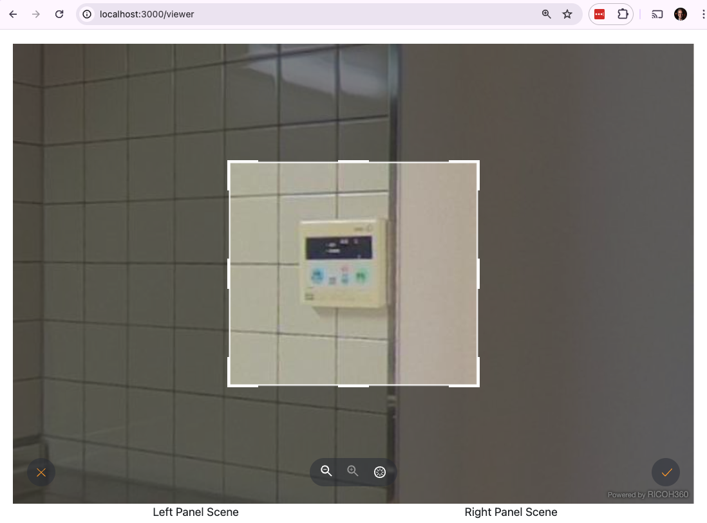

# Features

## A Note on Demo UI

* There is a main viewer that can show 1 image or 2 images side-by-side.
* Below the main image, there are two lists of images. Choose from the left list of images to pick the main viewer image. If you use the split screen, use the right list to choose the second image.
* If you choose split screen, upper right, the 2 images will be locked for moving and scrolling. This is to more easily compare the 2 images.
  * Example: Choose split screen. Choose a dark image on the left. Choose the same dark image on the right. Click the Enhance button, showing Low Light Enhancement. This displays Before and After side-by-side.
  * Note: If you want to test the Blur function, be sure to choose an image with people in it.

## Image Enhancement

## Split Screen

The RICOH360 Viewer can show a split screen view. component shown using RICOH's included image enhancement technology.

## Navigation

Navigation controls at bottom of screen allow viewer to select Zoom In, Zoom Out, Auto Rotate, Home Position, Enter Full Screen, Enter Cropping, and Enter Drawing.

## Annotation

Written notes and simple drawings appear in viewer.

## Cropping

Key portions of the 360° image can be cropped and saved locally.

Choose Enter Cropping

Select area

Save locally or Cancel

