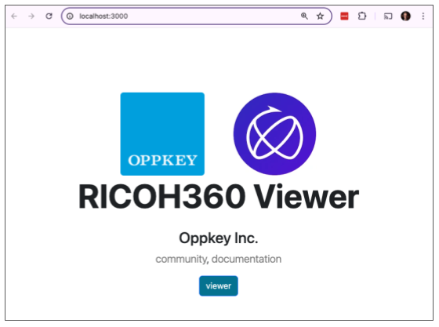
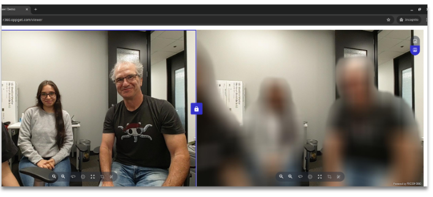

# Demo Overview


The demo is intended to be a live hosted site on AWS or Vercel. It consists of a backend server and a front end web application. The server can be run on a laptop with node.

---

## Process

1. Web browser goes to r360.oppget.com (business app server)
1. r360.oppget automatically pulls down RICOH Viewer and gains access with PrivateKey. Web token is generated for the Viewer access.
1. Using RICOH Viewer API and Client ID / Client Secret, a web token is generated for the RICOH360 content API
1. r360.oppkey contacts RICOH360 Content server and pulls down information, which is sent to web browser

---

## Step 1

### Go to Business Application Site

Developer builds a business application with login for their customers or staff to view and manage 360 image content



---

## Step 2

### Loading View in HTML

```javascript
<script src="https://r360pf-prod-static.s3.us-west-2.amazonaws.com/viewer/v0.11.1/ricoh360-viewer.js">
</script>
```

NOTE: The backend application must generate a token with the PrivateKey and make it available to the viewer. Example uses jsonwebtoken JavaScript package.

```javascript
const accessToken = jwt.sign(payload, privatekey, {
   algorithm: "RS256",
   expiresIn: "60m",
 });
```

The token for the viewer is not the same as the token generated for the RICOH360 Platform Content API.

---
## Step 3

### Generate Token for RICOH360 Platform API

```javascript
const tokenEndpoint =
   "https://saas-prod.auth.us-west-2.amazoncognito.com/oauth2/token";
 const auth = Buffer.from(`${clientId}:${clientSecret}`).toString("base64");
 const requestData = {
   method: "POST",
   headers: {
     "Content-Type": "application/x-www-form-urlencoded",
     Authorization: `Basic ${auth}`,
   },
   body: new URLSearchParams({
     grant_type: "client_credentials",
     scope: "all/read",
   }),
 };
 const tokenResponse = await fetch(tokenEndpoint, requestData);
 const tokenObject = await tokenResponse.json();
```

---

## Step 4

### Use Viewer Blur API from Button

```javascript
<button type="button" onclick="viewer.switchScene({ contentId: '${
                data[i].content_id
              }',transform:'b_person'},${0})">
                Blur People
              </button>
```

